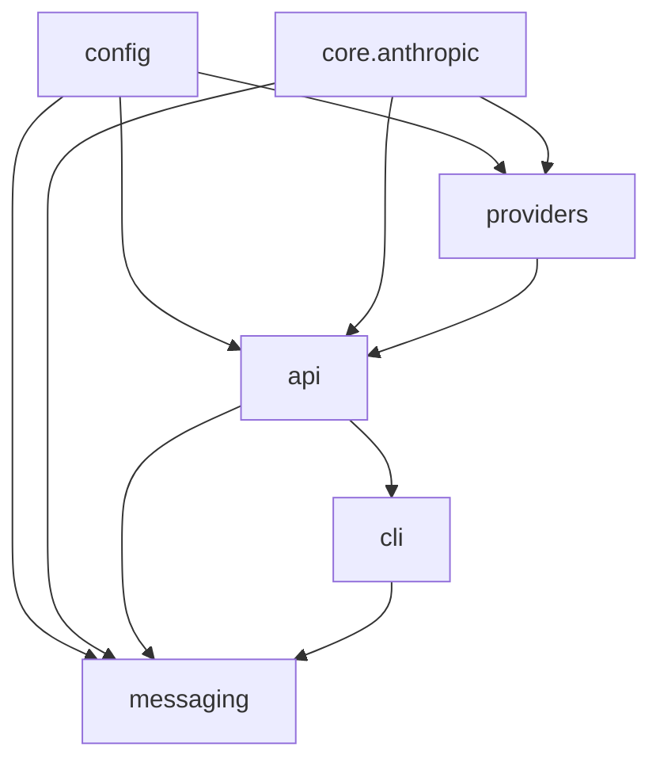

# LuxEngine (Free Claude Code) Project Review

This document contains a comprehensive architectural review and state-of-the-project assessment for **LuxEngine** (also known as `free-claude-code`), an Anthropic-compatible gateway proxy designed to route Claude Code request traffic to local and remote alternative model backends (including NVIDIA NIM, DeepSeek, OpenRouter, LM Studio, llama.cpp, and Ollama).

---

## 1. Executive Summary

LuxEngine is in an **extremely mature, production-ready state**. The core proxy architecture, routing logic, rate-limiting handlers, streaming/Server-Sent Events (SSE) adapters, and chat platform integrations (Discord/Telegram workers) are fully implemented.

### Project Health & Code Quality Metrics

| Metric | Status / Value | Comments |
| :--- | :--- | :--- |
| **Unit & Contract Tests** | **1,186 / 1,186 Passed** | Zero failures across a massive, comprehensive suite spanning API, providers, and messaging. |
| **Linting & Code Style** | **Ruff (Passed)** | 100% formatted and linted under Ruff rule groups (`E`, `W`, `F`, `I`, `UP`, `B`, `C4`, `SIM`, `PERF`, `RUF`). |
| **Type Checking** | **Ty (Passed)** | Full static type-safety verification using `ty` (Python 3.14 types) with zero type ignore suppressions. |
| **Dependency Management** | **Modern & Modular** | Fully managed via `pyproject.toml` and prepared for `uv` or standard Python virtual environments. |
| **Git Workspace** | **Clean** | Active `main` branch is clean, up-to-date, and 100% ready for versioning or deployment. |

---

## 2. Architectural Analysis

The codebase strictly adheres to the clean dependency flow defined in `PLAN.md`:

### Module Breakdown & Ownership
1. **`core/anthropic/` (Neutral Protocol Layer):** 
   - Handles Anthropic Messages API protocol schemas, request/response validation, token counting (`tiktoken`), content block parsing, and Server-Sent Events (SSE) stream tracking.
   - Absolutely independent of API routes, providers, and environment configurations.
2. **`providers/` (Upstream Transports):**
   - Owns upstream model adapters (`NvidiaNimProvider`, `OpenRouterProvider`, `DeepSeekProvider`, etc.).
   - Converts standard Anthropic payload structures into corresponding upstream targets (such as OpenAI Chat Completions for NVIDIA NIM) and normalizes thinking/reasoning blocks, tool calls, and upstream error shapes.
3. **`api/` (HTTP Routing & Lifespan):**
   - Fast, asynchronous web server built on FastAPI and Uvicorn.
   - Owns route handling (`/v1/messages`, `/v1/models`, `/v1/messages/count_tokens`), rate limiting, API token authentication, and app-level lifespan management.
4. **`messaging/` (Remote Workspaces):**
   - Discord and Telegram platform adapters allowing secure, reply-based remote terminal sessions and voice-note transcriptions (via Whisper or NVIDIA NIM offline ASR).
5. **`cli/` (CLI Tooling):**
   - Packages user entrypoints (`free-claude-code`, `fcc-init`) and supervises local subprocess sessions.
6. **`config/` (Settings & Provider Catalogs):**
   - Single source of truth for runtime configurations (`.env`) and supported model descriptors.

---

## 3. Branch Analysis: `main` vs. `ali/refactor`

A detailed investigation was conducted comparing the primary `main` branch and the remote branch `origin/ali/refactor` (which branched off approximately 5 weeks ago).

> [!IMPORTANT]
> **We strongly recommend retaining and continuing development on the `main` branch.**
> The `main` branch is significantly more advanced, contains essential security patches, and includes critical user features not present in the `ali/refactor` branch.

### Key Branch Mismatches

1. **Security Vulnerability in `ali/refactor`:**
   - **`main`** implements constant-time string comparison (`secrets.compare_digest`) for the `ANTHROPIC_AUTH_TOKEN` header to protect the proxy against timing side-channel attacks (CWE-208).
   - **`ali/refactor`** relies on standard inequality comparisons (`!=`), exposing the proxy authorization key to remote timing attacks.
2. **Missing Model Picker Features in `ali/refactor`:**
   - **`main`** features the **Claude Code native `/model` picker** (added in commit `72b34ad`), letting users pick routed models on-the-fly directly inside the Claude Code interface without restarts or `.env` modifications. It also filters OpenRouter variants by thinking support.
   - **`ali/refactor`** lacks the dynamic picker and forces users to rely exclusively on static environment variable routing.
3. **Refactoring Trades & Process Cache:**
   - **`ali/refactor`** attempted to fully eliminate the process-global cache `_providers` from `api/dependencies.py`.
   - While conceptually cleaner, the process-level cache on **`main`** is highly controlled and provides critical convenience functions for developer scripts and isolated unit tests (which run outside a full FastAPI HTTP server context).

---

## 4. What Needs to Be Done to Finish It Off

Given that the codebase's feature set is complete and fully verified, "finishing it off" is focused on **productionization, deployment reliability, CI/CD automation, and documentation coverage**.

Here is the recommended action plan:

### Phase 1: Establish Secure Local/Remote Deployments
- **Containerization (Optional / Opt-in):** Add a lightweight, secure `Dockerfile` (using `python:3.14-slim`) to run the FastAPI proxy easily in a isolated environment.
- **Process Manager Service:** Provide service definition templates for running the proxy as a background system service:
  - **Linux Systemd Service:** `free-claude-code.service` configuration template.
  - **Windows Service:** Instructions using NSSM (Non-Sucking Service Manager) to run the proxy continuously on Windows boot.

### Phase 2: Refine the Model Picker Experience
- Update the default provider models in `config/provider_catalog.py` to match the latest API lists for Ollama (e.g. Llama 3.3/3.2), DeepSeek (e.g. DeepSeek-V3, DeepSeek-R1), and NVIDIA NIM so the dynamic `/model` picker is fully up-to-date with 2026 releases.

### Phase 3: Enhance Developer Tooling & Automation
- **Verify Windows execution aliases:** Confirm that the standard shell scripts and virtual environment installation handles the local Python interpreter cleanly without invoking Windows store aliases.
- **Pre-commit Hooks:** Add a `.pre-commit-config.yaml` file so formatting, linting (Ruff), and type checking (Ty) are automatically verified locally before commits are created.

### Phase 4: Finalize Documentation & Setup Guides
- **Clerk Integration Guide:** Write a short setup guide for users integrating remote platforms, specifically resolving Clerk authentication or Cloudflare Turnstile barriers during remote workspace setups.
- **Reverse Proxy Configurations:** Provide standard `nginx` or `caddy` configuration templates for users running the proxy on a remote home server over SSL.
